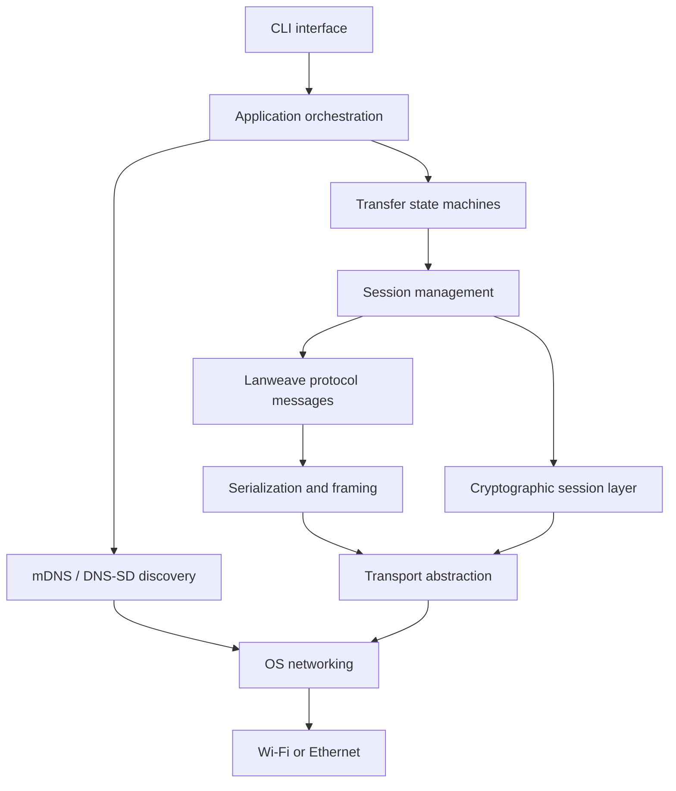

# Lanweave

> **Lanweave: A Secure Local Peer-to-Peer File Transfer Protocol**

Lanweave is a secure, open protocol and Rust CLI for peer-to-peer file exchange between devices on the same local network.

Lanweave is currently in the **design and research phase**. No discovery, networking, cryptography, command-line, or file-transfer functionality has been implemented.

## Why Lanweave

The problem I want to solve is ordinary: two computers are on the same network, and a person wants to move a file between them without first uploading it somewhere else. That should not require a cloud account, a central Lanweave server, or a closed protocol.

Lanweave's answer is an open protocol and a small Rust CLI. Peers find each other with mDNS/DNS-SD, the receiver chooses whether to accept a request, and a short-lived token ties that decision to the session. Files only move after the session has been authenticated and encrypted, and the receiver checks what it wrote before reporting success.

## Intended flow

1. Devices advertise `_lanweave._tcp.local.` and browse for peers.
2. A sender selects a receiver and files, then sends metadata-only summary information.
3. The receiver accepts or rejects the request.
4. On acceptance, the receiver displays a one-time, short-lived token.
5. The sender enters that token; the peers bind approval, token verification, identities, negotiated version, and key exchange to one session transcript.
6. Only after the secure session is confirmed are full metadata and file chunks sent.
7. The receiver writes to temporary files, verifies SHA-256, atomically finalizes them, and both peers report completion or failure.

The token authorizes a human-observed pairing. It is never used directly as a file-encryption key.

## Goals

- Local-first, serverless operation on ordinary Wi-Fi and Ethernet.
- Explicit receiver consent and secure-by-default transfers.
- An open, extensible, implementation-independent Lanweave Protocol.
- Interoperability across desktop platforms.
- Bounded memory, disk, CPU, and network resource use.
- A clear Rust CLI reference implementation with separable protocol, discovery, transport, crypto, transfer, and UI layers.

## Non-goals for the initial version

Trusted-device auto-acceptance, resumable transfers, folder synchronization, clipboard sharing, Android, graphical applications, internet relays, group transfer, Wi-Fi Direct, and Bluetooth-assisted discovery are future possibilities, not initial commitments. Lanweave is not a general remote filesystem or anonymity system and cannot protect a device already compromised by local malware.

## Where the design stands

I have made enough working choices to guide the first implementation, but several of them still need prototypes or security review:

- mDNS/DNS-SD discovery using `_lanweave._tcp.local.`.
- TCP for the first transport profile, with TLS 1.3 preferred for early channel confidentiality; QUIC remains a later candidate.
- CBOR with deterministic/canonical encoding rules and explicit length-delimited framing.
- Persistent Ed25519 device identity; X25519 ephemeral agreement; HKDF-SHA256; ChaCha20-Poly1305; SHA-256 file hashes.
- Receiver-generated one-time token, upgraded to a reviewed proof/PAKE construction before a security-stable release.

The exact binding between the human token, TLS, device identity, and the Lanweave transcript is **Needs Research** and must receive specialist review. See [cryptography](docs/CRYPTOGRAPHY.md) and [decision records](docs/DESIGN_DECISIONS.md).

## Architectural outline



Expected future repository structure:

```text
crates/
├── lanweave-protocol
├── lanweave-discovery
├── lanweave-transport
├── lanweave-crypto
├── lanweave-transfer
├── lanweave-core
└── lanweave-cli
docs/
```

The initial implementation may combine internal crates until their interfaces stabilize. See [Architecture](docs/ARCHITECTURE.md).

## Proposed CLI interface

These commands illustrate a future interface; they do not exist yet.

```bash
lanweave discover
lanweave send report.pdf
lanweave receive
lanweave identity
```

## Documentation

| Document | Purpose |
| --- | --- |
| [Project overview](docs/PROJECT_OVERVIEW.md) | Scope, users, assumptions, goals, and principles |
| [Protocol specification](docs/PROTOCOL.md) | Normative phases, invariants, limits, and failure behavior |
| [Message format](docs/MESSAGE_FORMAT.md) | Typed messages, identifiers, serialization, and framing |
| [Architecture](docs/ARCHITECTURE.md) | Layers, separation rules, and proposed Rust workspace |
| [State machines](docs/STATE_MACHINES.md) | Valid states, events, transitions, and recovery |
| [Sequence diagrams](docs/SEQUENCE_DIAGRAMS.md) | Successful and failure message flows |
| [Discovery](docs/DISCOVERY.md) | mDNS/DNS-SD advertisement and privacy |
| [Transport](docs/TRANSPORT.md) | TCP/TLS and QUIC comparison and byte flow |
| [Cryptography](docs/CRYPTOGRAPHY.md) | Primitive roles and unresolved handshake binding |
| [Security](docs/SECURITY.md) | Objectives, boundaries, and safe handling requirements |
| [Threat model](docs/THREAT_MODEL.md) | Structured threats, mitigations, and residual risk |
| [File transfer](docs/FILE_TRANSFER.md) | Streaming, flow control, hashing, and safe finalization |
| [Error handling](docs/ERROR_HANDLING.md) | Error taxonomy, wire codes, and state effects |
| [Versioning](docs/VERSIONING.md) | Compatibility and schema evolution |
| [Design decisions](docs/DESIGN_DECISIONS.md) | Accepted, proposed, deferred, and research decisions |
| [Research plan](docs/RESEARCH_PLAN.md) | First-week evidence-gathering plan |
| [Testing strategy](docs/TESTING_STRATEGY.md) | Test layers, invariants, fuzzing, and compatibility |
| [Implementation roadmap](docs/IMPLEMENTATION_ROADMAP.md) | Documentation-only two-month implementation plan |
| [Glossary](docs/GLOSSARY.md) | Canonical terminology |

## Development phases

The order of work is intentional. I will settle the wire format and state machines first, then discovery and identity, then the request and pairing flow. File transfer comes after those pieces can establish a session I am prepared to trust.

The first real milestone is one dependable file transfer. Multi-file support and packaging come later, and they should be cut before the single-file path is rushed.

## Security status

> **Experimental design:** Lanweave has not received a security audit. The specification contains unresolved security-sensitive choices. Future builds must not be represented as production-secure until the handshake, token verification, parsers, key storage, and filesystem behavior have been reviewed and tested.

Do not use early prototypes for sensitive data. Report suspected vulnerabilities privately through a future security policy rather than a public issue.

## Contributing

Design changes are welcome, especially when they come with testable reasoning. Please say which assumptions you are changing and update the affected messages, states, diagrams, compatibility rules, and threats together.

Cryptographic changes need more than a plausible sketch: point to a reviewed construction and expect specialist review. Code contributions will make sense once the workspace exists; at the moment, the repository is still working through the design.

## Licence

I have not chosen the final licences yet. Before accepting contributions or publishing a release, I will select an OSI-approved source licence, decide how the specification and documentation are licensed, and publish a contributor policy.
