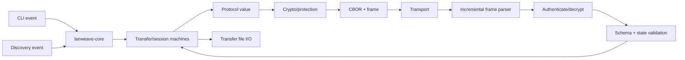

# Architecture

## Layered model

```text
CLI interface
Application orchestration
Transfer state machines
Session management
Lanweave protocol messages
Serialization and framing
Cryptographic session layer
Transport abstraction
mDNS/DNS-SD discovery
Operating-system networking
Wi-Fi or Ethernet
```

The stack is conceptual, not a requirement that every layer become a crate.

| Layer | Responsibility | Must not decide |
| --- | --- | --- |
| CLI interface | Parse proposed commands, render peers/prompts/progress, collect approval/token/destination | Message validity, crypto, or path safety |
| Application orchestration | Coordinate discovery, user policy, sessions, files, shutdown | Reimplement framing or primitives |
| Transfer state machines | Authoritative transition validation and timeout effects | Terminal rendering or socket reads |
| Session management | Correlation, negotiated parameters, transcript/session lifecycle, replay/sequence context | Filesystem destination policy |
| Protocol messages | Language-neutral typed schemas and semantic validation | CLI or Tokio dependencies |
| Serialization/framing | CBOR mapping, canonical form, lengths, incremental parsing, frame limits | Application transitions |
| Cryptographic session | Identity interface, reviewed handshake, key derivation, AEAD, erasure | Homemade algorithms or user policy |
| Transport abstraction | Connect/listen/read/write/close, addresses, backpressure | Treat bytes as application approval |
| Discovery | Register/browse/resolve `_lanweave._tcp.local.` and expire candidates | Authentication or transfer |
| OS networking | Socket/interface/firewall integration | Protocol semantics |
| Wi-Fi/Ethernet | Packet delivery | Trustworthiness of peers |

Discovery is a side input to orchestration rather than a layer through which transfer bytes pass.

## Separation rules

- CLI code MUST NOT contain protocol logic; it submits typed user events.
- `lanweave-protocol` MUST NOT depend on terminal/CLI libraries.
- Discovery MUST NOT open files, approve requests, or transfer bytes.
- Transport reports connection events/bytes/backpressure; it MUST NOT select state transitions.
- Cryptographic primitives MUST come from reviewed, maintained libraries and MUST NOT be implemented manually.
- File I/O MUST use locally selected roots, validated names, no-follow semantics where possible, and temporary files; it MUST NOT trust remote filenames.
- One central state-machine boundary validates role, state, IDs, correlation, protection level, and sequence before dispatch.
- Parsers validate frame bounds before allocation and schema bounds before expensive work.
- Network tasks do not block on terminal input or disk I/O; bounded channels provide backpressure.
- Logs receive redacted structured events, never secrets or untrusted terminal control sequences.

## Component flow



Inbound order is security-critical: frame bound → deserialize bound → cryptographic verification → session/sequence validation → semantic/state validation → side effect.

## Proposed Rust workspace

| Crate | Responsibility and public boundary | Allowed dependencies | Excluded |
| --- | --- | --- | --- |
| `lanweave-protocol` | IDs, enums, message structs, validation traits, version/capability model; pure byte-independent domain types where practical | Serialization facade and small utility crates | CLI, sockets, mDNS, filesystem, secret-key storage |
| `lanweave-discovery` | Advertise, browse, resolve, normalize/expire candidate endpoints; emits discovery events | Protocol discovery record types; OS mDNS adapter | Trust decisions, connections, transfer state |
| `lanweave-transport` | Async listener/connector, framed I/O traits, TCP/TLS profile, address racing | Protocol frames; crypto channel interface | Consent, metadata policy, direct terminal I/O |
| `lanweave-crypto` | Secret types, identity signing interface, handshake profile, HKDF/AEAD, transcript and key erasure | Audited crypto/TLS libraries; protocol crypto DTOs | Primitive implementations, file hashing policy, CLI |
| `lanweave-transfer` | Safe source snapshots, destination planning, streaming, hashing, temporary/final files, progress | Protocol metadata; async I/O | Network discovery, prompts, session authentication |
| `lanweave-core` | Application services and central state machines; composes all interfaces | All library crates through narrow APIs | CLI rendering and OS-specific presentation |
| `lanweave-cli` | Proposed commands, configuration, prompts, progress, exit codes | `lanweave-core` | Wire parsing, cryptographic operations, path acceptance |

### How many crates should I start with?

The seven-crate layout above is a useful map of the system, but it is too much structure for the first few weeks. Creating every crate immediately would force me to settle public APIs before I have learned where the real boundaries are.

I will start with three crates:

1. `lanweave-protocol` (must remain implementation-independent),
2. `lanweave-core` (internal modules for discovery, transport, crypto, transfer),
3. `lanweave-cli`.

Discovery, transport, cryptography, and transfer can live as separate modules inside `lanweave-core` to begin with. I will move a module into its own crate when there is a concrete reason: another implementation needs to reuse it, platform-specific code is getting in the way, a fuzz target benefits from a smaller dependency graph, or dependency isolation has become useful.

The dependency direction stays simple: `cli → core → protocol`. In particular, `lanweave-protocol` must never depend on the CLI or application layer. I have recorded this as a proposed choice in [Design Decisions](DESIGN_DECISIONS.md).

## Concurrency and ownership

Each active session should have one clear owner for its mutable state. Socket readers feed bounded events to that owner; after validation, it tells the writer and file workers what to do. File workers stream through bounded buffers, and cancellation is an ordinary idempotent command rather than an exceptional side channel. A shared map should not become the hidden source of truth for a session.

The long-term device identity should be accessed through a small key-provider interface so private key bytes do not spread through the workspace. Instance IDs and ephemeral keys belong only to the process or session that created them.

## Configuration versus protocol

Timeout defaults, concurrency, destination directories, overwrite behavior, display names, and logging are local configuration. Wire maxima, message meaning, state order, cryptographic binding, and compatibility rules are protocol requirements. A local policy may be stricter but must respond predictably.

See [State Machines](STATE_MACHINES.md), [Transport](TRANSPORT.md), and [File Transfer](FILE_TRANSFER.md).
