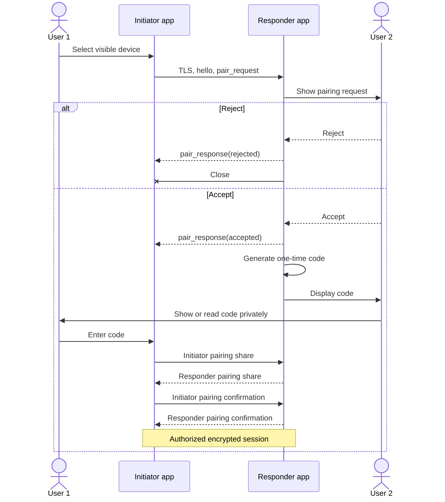
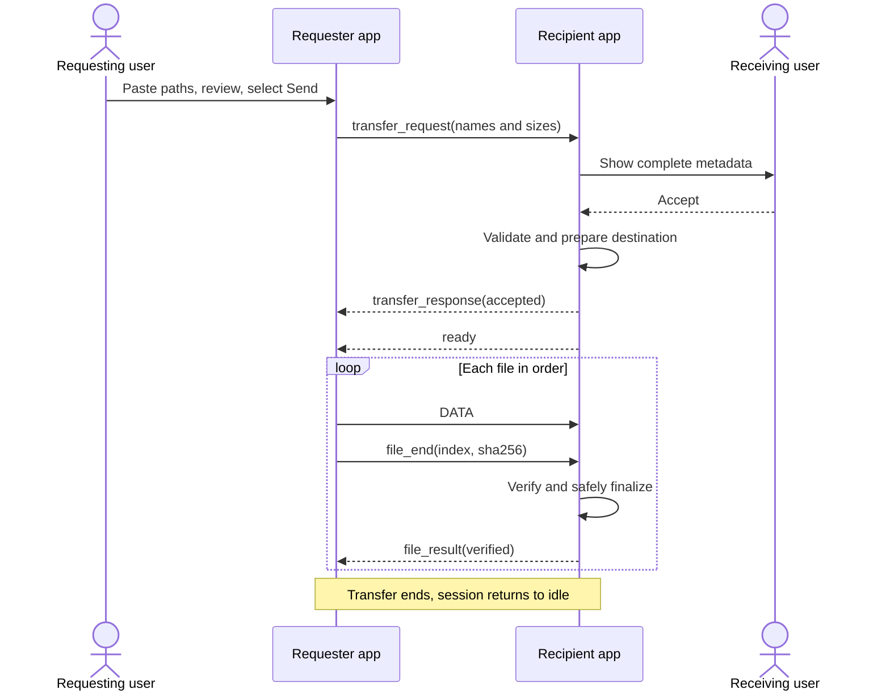
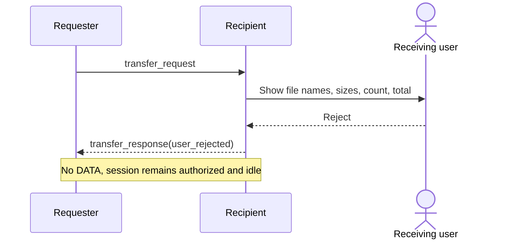
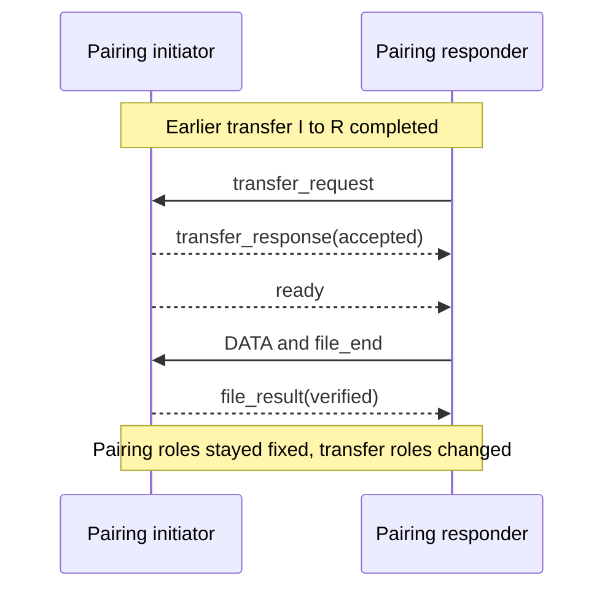
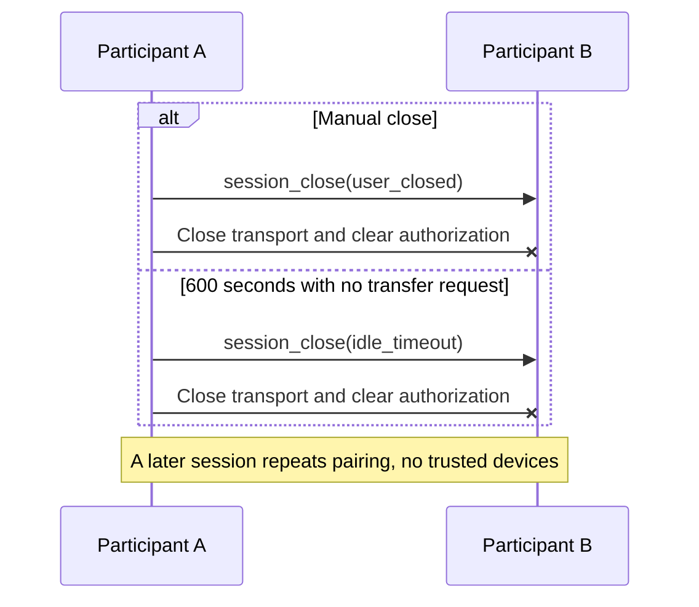

# Sequence Diagrams

## Pairing And Authorization

The code is shown locally by the responder and entered locally by the initiator. It is not sent as a normal wire field.

## Transfer Request And Success

## Transfer Rejection

## Reverse Transfer

## Idle And Manual Close

