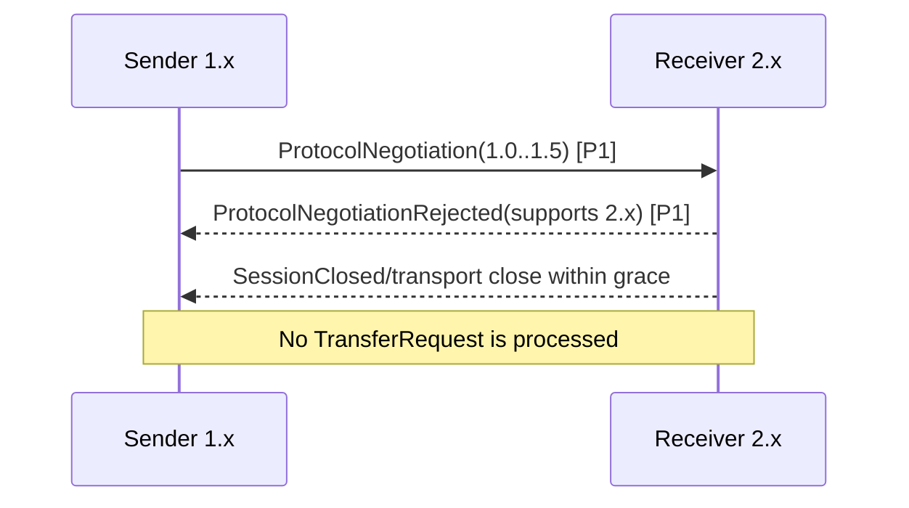
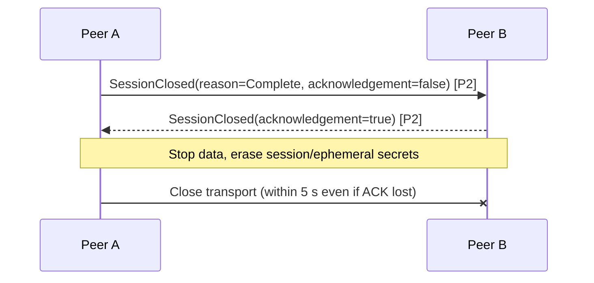
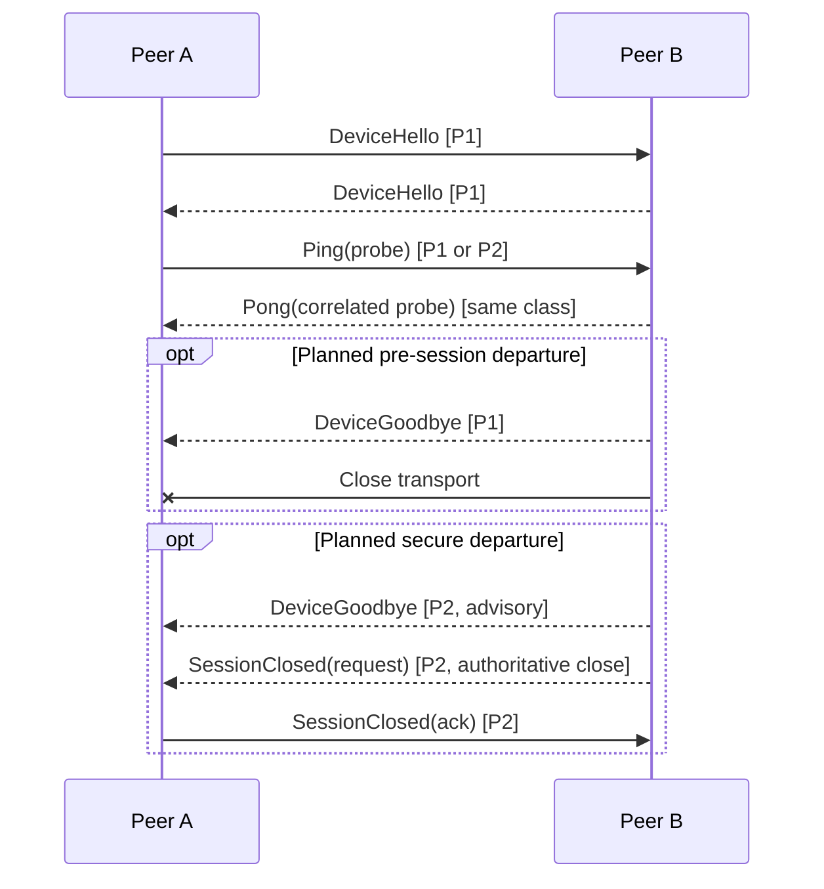

# Sequence Diagrams

## Legend

- `P0` — unauthenticated discovery/preface.
- `P1` — provisional channel (TLS confidentiality recommended, but peer not yet pairing-authenticated).
- `P2` — pairing-authenticated secure session; encrypted, authenticated, sequenced.

Full file metadata and all content are P2 only. Diagrams abbreviate validation/error cleanup but use canonical message names.

## 1. Device discovery

```mermaid
sequenceDiagram
    participant R as Receiver
    participant M as mDNS/DNS-SD
    participant S as Sender
    R->>M: Register _lanweave._tcp.local. (PTR/SRV/minimal TXT/A/AAAA) [P0]
    S->>M: Browse _lanweave._tcp.local. [P0]
    M-->>S: Service instance + TTL [P0, untrusted]
    S->>M: Resolve SRV/TXT/A/AAAA [P0]
    M-->>S: Port + scoped candidate addresses [P0]
    Note over S: Deduplicate/filter; never authenticate from discovery
    R-->>M: Goodbye/deregister on graceful stop [P0]
    M-->>S: Removal, or S expires TTL
```

## 2. Successful transfer

```mermaid
sequenceDiagram
    actor SU as Sending user
    participant S as Sender
    participant M as mDNS discovery
    participant T as Transport connection
    participant R as Receiver
    actor RU as Receiving user
    R->>M: Advertise _lanweave._tcp.local. [P0]
    S->>M: Browse and resolve [P0]
    SU->>S: Select receiver and file(s)
    S->>T: Open TCP + proposed TLS 1.3 channel
    T->>R: Connected
    S->>R: DeviceHello [P1]
    R-->>S: DeviceHello [P1]
    S->>R: ProtocolNegotiation [P1]
    R-->>S: ProtocolNegotiationAccepted [P1]
    S->>R: TransferRequest (summary only) [P1]
    R->>RU: Show sender, names, counts, sizes
    RU->>R: Accept
    R-->>S: TransferAccepted [P1]
    Note over R: Generate one-time token; display locally
    R->>RU: Display token
    R-->>S: PairingTokenChallenge (no token) [P1]
    SU->>S: Enter displayed token
    S->>R: PairingTokenSubmission/proof [P1]
    Note over R: Verify, count attempt, consume on success
    R-->>S: PairingTokenAccepted [P1]
    S->>R: KeyExchangeInit [P1/handshake]
    R-->>S: KeyExchangeResponse [P1/handshake]
    Note over S,R: Bind approval, token result, identities,<br/>version, ephemeral exchange, IDs, transcript
    S->>R: SessionEstablished [P2 confirmation]
    R-->>S: SessionEstablished [P2 confirmation]
    Note over S,R: P2 secure session active after both verify
    loop Each file
        S->>R: FileMetadata [P2]
    end
    R-->>S: TransferReady [P2]
    loop Bounded chunks
        S->>R: FileChunk [P2]
        R-->>S: ChunkAcknowledgement at checkpoint [P2]
    end
    S->>R: FileComplete(size, SHA-256) [P2]
    Note over R: Verify received length/hash; atomically finalize
    R-->>S: TransferComplete(report) [P2]
    S->>R: TransferComplete(confirmation) [P2]
    S->>R: SessionClosed(request) [P2]
    R-->>S: SessionClosed(ack) [P2]
    T-->>S: Close transport and erase session secrets
```

## 3. Receiver rejects request

```mermaid
sequenceDiagram
    participant S as Sender
    participant R as Receiver
    actor U as Receiving user
    S->>R: TransferRequest [P1]
    R->>U: Display bounded summary
    U->>R: Reject
    R-->>S: TransferRejected(UserRejected) [P1]
    Note over S,R: Request terminal; no token, key exchange, metadata, or file data
```

## 4. Incorrect token

```mermaid
sequenceDiagram
    participant S as Sender
    participant R as Receiver
    R-->>S: PairingTokenChallenge(attempts=5, expiry) [P1]
    S->>R: PairingTokenSubmission(attempt 1) [P1]
    R-->>S: PairingTokenRejected(Invalid, remaining=4) [P1]
    Note over R: Original deadline unchanged; attempt paced
    S->>R: PairingTokenSubmission(attempt 2) [P1]
    R-->>S: PairingTokenAccepted [P1]
    Note over S,R: Continue reviewed key exchange; token success alone is not secure session
```

## 5. Token expires

```mermaid
sequenceDiagram
    participant S as Sender
    participant R as Receiver
    R-->>S: PairingTokenChallenge(expires_in=60s) [P1]
    Note over R: Local monotonic deadline passes; consume token
    S->>R: PairingTokenSubmission(late) [P1]
    R-->>S: PairingTokenRejected(Expired) [P1]
    R-->>S: Error(ExpiredToken, fatal) [P1, optional]
    Note over S,R: Pairing failed; new request/approval required
```

## 6. Incompatible protocol versions



## 7. Secure-session establishment

```mermaid
sequenceDiagram
    participant S as Initiator/Sender
    participant R as Responder/Receiver
    Note over S,R: Negotiation, approval, challenge, and token verification already recorded [P1]
    S->>R: KeyExchangeInit(profile, opaque handshake_data, transcript_hash) [handshake]
    R->>R: Validate profile/step/transcript; contribute fresh ephemeral state
    R-->>S: KeyExchangeResponse(profile, opaque handshake_data, transcript_hash) [handshake]
    S->>S: Verify identity, token binding, negotiation; derive direction-separated keys
    R->>R: Derive same session context; erase ephemeral intermediates
    S->>R: SessionEstablished(session_id, transcript, initiator confirmation) [P2]
    R->>S: SessionEstablished(session_id, transcript, responder confirmation) [P2]
    Note over S,R: Only now may FileMetadata/TransferReady/FileChunk be accepted
```

The opaque handshake data must be defined by the reviewed profile selected after DD-005/DD-010 research; this diagram is not a custom construction.

## 8. Single-file transfer

```mermaid
sequenceDiagram
    participant S as Sender
    participant R as Receiver
    S->>R: FileMetadata(file A, size N, optional hash) [P2]
    R-->>S: TransferReady(chunk=256KiB, window=8MiB) [P2]
    loop Until N bytes
        S->>R: FileChunk(A, exact next offset) [P2]
        opt 4MiB / 1s checkpoint
            R-->>S: ChunkAcknowledgement(A, next_offset) [P2]
        end
    end
    S->>R: FileComplete(A, N, SHA-256) [P2]
    R->>R: Compare received length/hash; finalize temp
    R-->>S: TransferComplete(report) [P2]
    S->>R: TransferComplete(confirmation) [P2]
```

## 9. Multiple-file transfer

```mermaid
sequenceDiagram
    participant S as Sender
    participant R as Receiver
    S->>R: FileMetadata(A, ordinal 0) [P2]
    S->>R: FileMetadata(B, ordinal 1) [P2]
    R-->>S: TransferReady(manifest hash) [P2]
    loop File A then file B, sequentially
        loop Chunks for current file
            S->>R: FileChunk [P2]
            R-->>S: ChunkAcknowledgement(checkpoint) [P2]
        end
        S->>R: FileComplete [P2]
        R->>R: Verify and finalize current file
    end
    R-->>S: TransferComplete(files=2) [P2]
    S->>R: TransferComplete(confirmation) [P2]
    Note over S,R: Whole-transfer atomicity is not guaranteed; partial completion policy must be displayed
```

## 10. User cancellation during transfer

```mermaid
sequenceDiagram
    actor U as User
    participant S as Sender
    participant R as Receiver
    S->>R: FileChunk [P2]
    U->>S: Cancel
    S-xR: Stop scheduling new chunks
    S->>R: TransferCancelled(scope=Transfer, reason=User) [P2]
    R->>R: Stop writes; delete partial temp; keep/report any already finalized files
    R-->>S: SessionClosed(reason=Cancelled, request) [P2]
    S->>R: SessionClosed(ack) [P2]
```

## 11. Network connection loss

```mermaid
sequenceDiagram
    participant S as Sender
    participant N as Network
    participant R as Receiver
    S->>N: FileChunk [P2]
    N-xR: Connection reset / timeout
    S->>S: Transfer → Failed; erase secrets
    R->>R: Transfer → Failed; close temp and clean partial
    Note over S,R: No TransferComplete; initial protocol does not resume
```

## 12. Hash-verification failure

```mermaid
sequenceDiagram
    participant S as Sender
    participant R as Receiver
    S->>R: FileComplete(file A, size, SHA-256 X) [P2]
    R->>R: Final received digest Y != X
    R-xR: Do not finalize; delete/quarantine temp by local policy
    R-->>S: Error(HashMismatch, file A, fatal) [P2]
    Note over S,R: Transfer → Failed; no completion confirmation
    R-->>S: SessionClosed(reason=Error) [P2]
```

## 13. Graceful session close



## 14. Malicious or malformed message

```mermaid
sequenceDiagram
    participant A as Malicious peer
    participant F as Frame/parser boundary
    participant R as Receiver
    A->>F: Header claims > maximum / malformed CBOR / wrong-state FileChunk
    alt Oversized or unparseable/authentication failure
        F-xA: Close immediately; no attacker-sized allocation or detailed oracle
    else Parseable but semantically invalid
        F->>R: Bounded typed validation error
        R-->>A: Error(InvalidMessage or UnexpectedMessage, fatal) [matching protection]
        R-xA: Close and cleanup
    end
    Note over R: No prompt, destination write, token creation, or file finalization
```

## Message coverage and connection control

The scenario diagrams cover the transfer messages directly. The remaining connection-control path is:



Coverage index: `ProtocolNegotiation`, `ProtocolNegotiationAccepted`, and `ProtocolNegotiationRejected` appear in scenarios 2 and 6; `TransferRequest`, `TransferAccepted`, and `TransferRejected` in 2–3; `PairingTokenChallenge`, `PairingTokenSubmission`, `PairingTokenAccepted`, and `PairingTokenRejected` in 2, 4, and 5; `KeyExchangeInit`, `KeyExchangeResponse`, and `SessionEstablished` in 2 and 7; `FileMetadata`, `TransferReady`, `FileChunk`, `ChunkAcknowledgement`, `FileComplete`, and `TransferComplete` in 2, 8, and 9; `TransferCancelled` in 10; `SessionClosed` in 2, 10, 12, and 13; `Error` in 5, 12, and 14. Every one is subject to the [state ownership table](STATE_MACHINES.md#complete-message-to-state-ownership), even when a diagram omits envelope fields.
