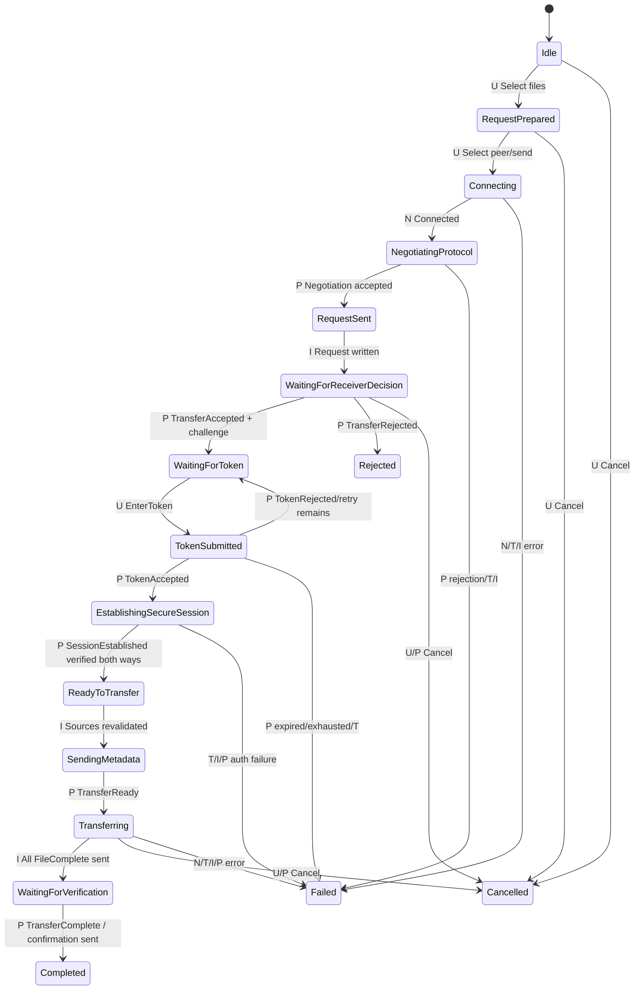
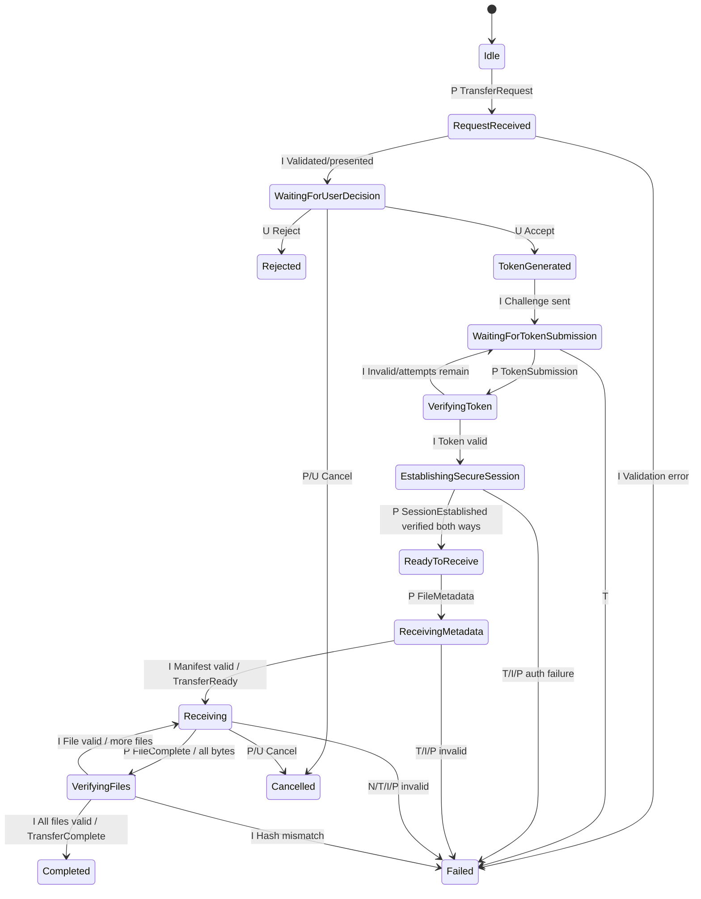
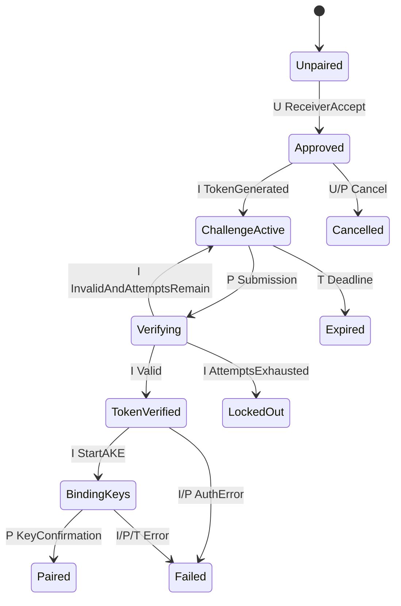
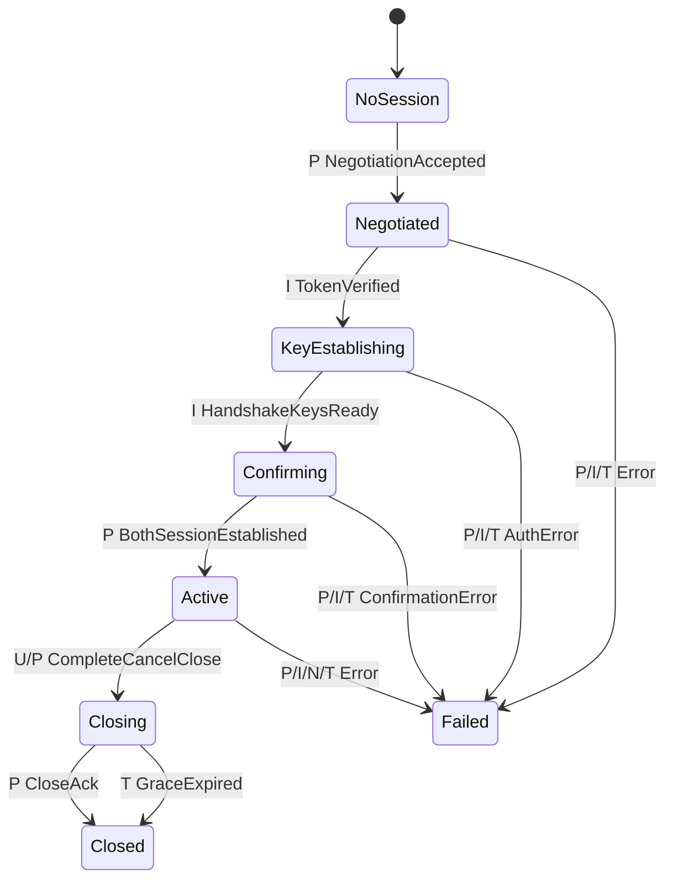
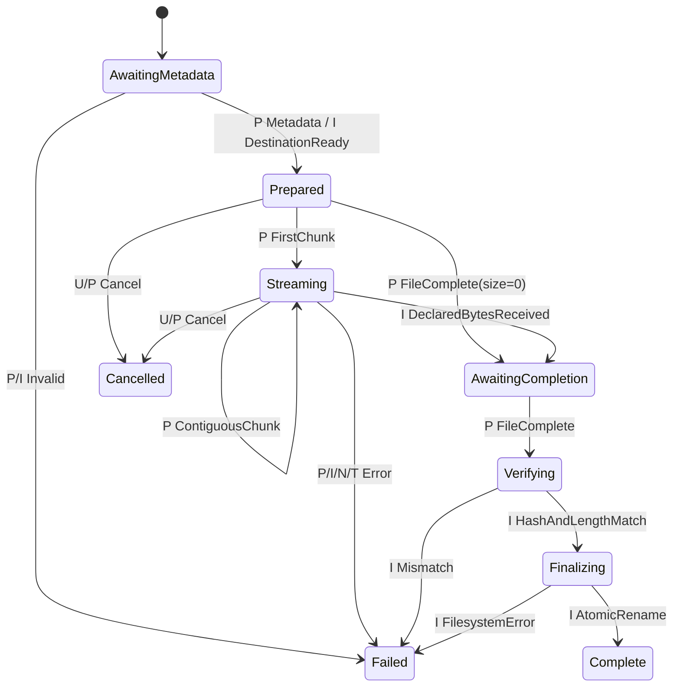
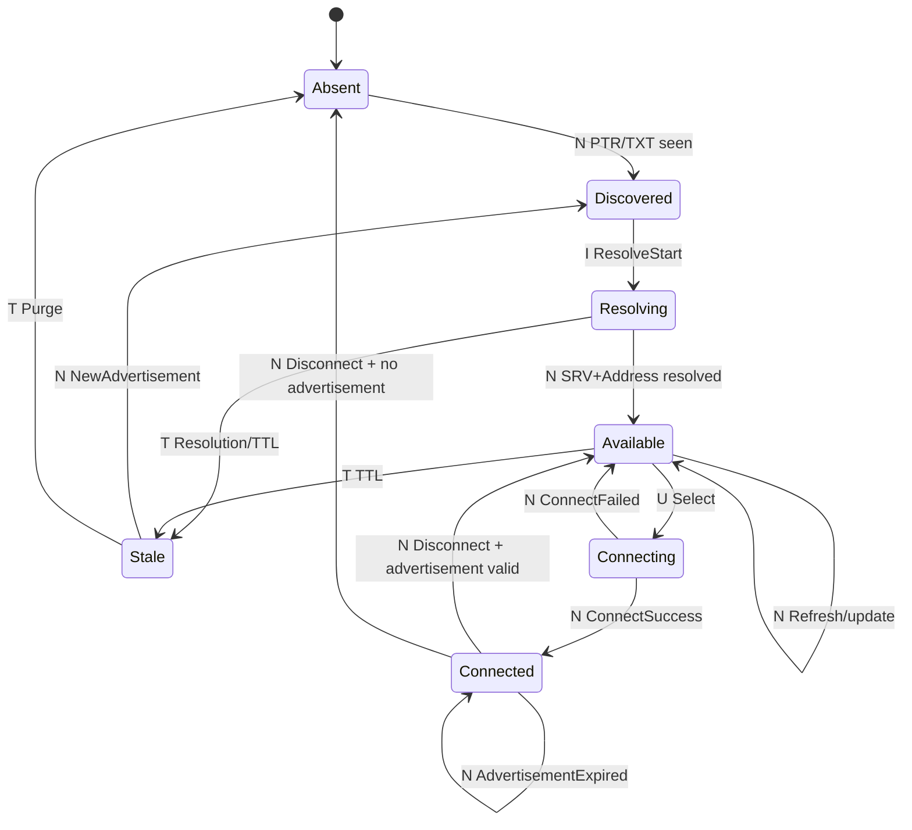

# State Machines

## Event model and shared rules

One central reducer owns each machine. Events are tagged:

- **U** — local user (`Select`, `Accept`, `Reject`, `EnterToken`, `Cancel`).
- **P** — validated remote protocol message.
- **N** — network/discovery event (`Connected`, `Disconnected`, advertisement change).
- **T** — monotonic timeout.
- **I** — internal result/error (file opened, hash result, storage failure, crypto result).

Before reduction, the session layer validates frame/message protection, role, message and correlation IDs, version/capability, sequence, and bounds. Any peer message not listed for the current state is invalid: send `UnexpectedMessage` if safe, transition to `Failed`, erase secrets/clean partials, and normally close. Duplicate cancellation and close acknowledgements are the only broadly idempotent exceptions. Terminal states never reactivate; starting another transfer creates new machine instances and identifiers.

## Outgoing transfer (sender)

| State | Meaning | Valid event → next state | Timeout/recovery |
| --- | --- | --- | --- |
| `Idle` | No outgoing operation | U select → `RequestPrepared` | None |
| `RequestPrepared` | Safe summaries/handles prepared | U send → `Connecting`; U cancel → `Cancelled` | Source error → `Failed`; user may reselect before send |
| `Connecting` | Candidate endpoints attempted | N connected → `NegotiatingProtocol` | 10 s/candidate, 20 s total → `Failed`; try next candidate |
| `NegotiatingProtocol` | Compatibility exchange only | P accepted → `RequestSent`; P rejected → `Failed` | 10 s → `Failed`/close |
| `RequestSent` | `TransferRequest` queued/written | I written → `WaitingForReceiverDecision` | Write failure → `Failed` |
| `WaitingForReceiverDecision` | Receiver prompt pending | P accepted → `WaitingForToken`; P rejected → `Rejected`; cancel → `Cancelled` | 120 s → cancel/fail request |
| `WaitingForToken` | Challenge visible; await user input | U token → `TokenSubmitted`; cancel → `Cancelled` | Challenge remainder → `Failed`; new challenge requires new approval |
| `TokenSubmitted` | One attempt in flight | P accepted → `EstablishingSecureSession`; P invalid with attempts → `WaitingForToken`; expired/exhausted → `Failed` | Remaining token deadline → `Failed` |
| `EstablishingSecureSession` | Reviewed AKE and confirmations | P valid confirmation/I crypto → `ReadyToTransfer` after both | 10 s or any auth error → erase/`Failed` |
| `ReadyToTransfer` | Secure but manifest not sent | I sources valid → `SendingMetadata` | Source change → `Failed` |
| `SendingMetadata` | Send exact manifest | P ready → `Transferring` | 30 s/session idle → `Failed` |
| `Transferring` | Sequential chunks/ACK windows | I all file completions → `WaitingForVerification`; cancel → `Cancelled` | 30 s inactivity, ping +10 s → `Failed` |
| `WaitingForVerification` | Await receiver final result | P complete → send confirmation/`Completed` | 30 s → `Failed`; initial no resume |
| `Completed`/`Rejected`/`Cancelled`/`Failed` | Terminal result | Close only | Cleanup, erase secrets; new operation uses fresh machine |

## Incoming transfer (receiver)

| State | Meaning | Valid event → next state | Timeout/recovery |
| --- | --- | --- | --- |
| `Idle` | Negotiated connection accepts bounded request | P request → `RequestReceived` | Busy policy may reject without new machine |
| `RequestReceived` | Summary validation/storage precheck | I valid → `WaitingForUserDecision`; invalid → `Failed`/reject | Cheap validation deadline |
| `WaitingForUserDecision` | Local prompt | U accept → `TokenGenerated`; U reject → `Rejected`; P cancel → `Cancelled` | 120 s → `Rejected` (`ExpiredRequest`) |
| `TokenGenerated` | IDs/token generated after consent | I challenge sent → `WaitingForTokenSubmission` | RNG failure → `Failed`; token never persisted |
| `WaitingForTokenSubmission` | One challenge active | P submission → `VerifyingToken`; cancel → `Cancelled` | 60 s → consume token/`Failed` |
| `VerifyingToken` | Count and verify one attempt | I valid → `EstablishingSecureSession`; invalid+budget → waiting; expired/exhausted → `Failed` | Original deadline never extends |
| `EstablishingSecureSession` | AKE/transcript/key confirmation | confirmations → `ReadyToReceive` | 10 s/auth error → erase/`Failed` |
| `ReadyToReceive` | Secure session allows metadata | P metadata → `ReceivingMetadata` | Idle timeout → `Failed` |
| `ReceivingMetadata` | Build/validate exact manifest and temp plan | I all safe → send ready/`Receiving`; invalid/storage → `Failed` | Idle timeout; no chunks valid here |
| `Receiving` | Write/hash sequential current file | P file complete → `VerifyingFiles`; cancel → `Cancelled` | Inactivity/write/network error → `Failed` |
| `VerifyingFiles` | Compare size/hash and finalize | I valid+more → `Receiving`; I all → `Completed`; mismatch → `Failed` | No final name on failure |
| terminal states | Result fixed | Close only | Cleanup partials, erase secrets; finalized earlier files reported if multi-file policy permits |

## Pairing machine

| State | Invariant and events | Terminal/recovery |
| --- | --- | --- |
| `Unpaired` | No token; only explicit receiver accept enters `Approved` | Cancel is terminal for request |
| `Approved` | Approval bound to request/transfer/pairing IDs | RNG error fails; never reuse approval for new challenge without policy |
| `ChallengeActive` | Exactly one unconsumed token, deadline, attempt counter | Submission → verify; timeout → `Expired`; cancellation consumes |
| `Verifying` | One counted attempt; concurrent submissions rejected | Invalid returns only if budget/time remains; valid consumes token |
| `TokenVerified` | Authorization result exists but no secure identity yet | Only start reviewed AKE; file messages invalid |
| `BindingKeys` | Identities/version/challenge/transcript/KEX being confirmed | Success → `Paired`; error → `Failed` and no retry in transcript |
| `Paired` | Pairing result usable only by one secure session | Terminal; new session needs new pairing in 1.0 |
| `Expired`/`LockedOut`/`Cancelled`/`Failed` | Token consumed and terminal | New receiver approval/request required |

## Secure-session machine

| State | Allowed behavior | Timeout/failure |
| --- | --- | --- |
| `NoSession` | Hello/negotiation only | Connection deadline |
| `Negotiated` | Request/decision/pairing only; P1 | Request/pairing timers |
| `KeyEstablishing` | Handshake messages only | 10 s; erase on failure |
| `Confirming` | Protected `SessionEstablished` only (plus fatal error) | 10 s; mismatch closes |
| `Active` | P2 metadata/data/control with exact sequences | 5 min idle; transfer inactivity separately |
| `Closing` | No new data; `SessionClosed` ack/cancel/error only | 5 s then close/erase |
| `Closed`/`Failed` | Terminal; no key/ID reuse | Reconnect creates fresh state and keys |

## Individual file machine

| State | Valid input/invariant | Recovery |
| --- | --- | --- |
| `AwaitingMetadata` | One metadata record in ordinal order | Invalid name/size fails before temp exposure |
| `Prepared` | Safe temp destination and hash context; offset 0 | Zero file skips chunks; cancellation deletes temp |
| `Streaming` | Only exact next contiguous chunk within size/window | Checkpoint ACKs; any gap/overflow fails; no resume |
| `AwaitingCompletion` | Exact declared byte count reached | Only matching `FileComplete`; timeout fails |
| `Verifying` | Compare receiver digest/length with sender/metadata | Mismatch terminal; no finalize |
| `Finalizing` | Flush/close/atomic rename per policy | Failure leaves existing destination intact where possible |
| `Complete`/`Cancelled`/`Failed` | Terminal | Partials cleaned; completed file immutable to protocol |

## Discovery lifecycle

| State | Meaning | Special rule |
| --- | --- | --- |
| `Absent` | No current cache entry | New advert creates untrusted candidate |
| `Discovered` | Service instance seen, unresolved | Duplicate labels do not merge identity |
| `Resolving` | Fetching SRV/TXT/A/AAAA | Bound attempts; preserve interface scope |
| `Available` | Candidate endpoint(s) current | Not authenticated; self-filter cautiously |
| `Connecting` | Bounded address attempts | Failure does not delete advertisement |
| `Connected` | Active transport owns liveness | mDNS expiry MUST NOT terminate connection |
| `Stale` | TTL expired/unresolved | Hide from selection; purge after local grace |

## Cancellation and failure precedence

If valid `TransferComplete` is fully processed before cancel, completion wins; otherwise cancellation stops new side effects. Authentication/hash/filesystem failure wins over a simultaneous success not yet committed. Reducers serialize events so one transition is authoritative and emit idempotent cleanup commands. There is no automatic resume or retry of a failed secure session in version 1.0.

## Complete message-to-state ownership

This index prevents “utility” messages from bypassing central validation.

| Messages | Owning machine and acceptance point |
| --- | --- |
| `DeviceHello`, `DeviceGoodbye` | Secure-session/connection machine in pre-negotiation or matching connected state; goodbye is advisory only |
| `ProtocolNegotiation`, `ProtocolNegotiationAccepted`, `ProtocolNegotiationRejected` | Secure-session machine in `NoSession` negotiation substate |
| `TransferRequest`, `TransferAccepted`, `TransferRejected` | Outgoing/incoming transfer machines before pairing |
| `PairingTokenChallenge`, `PairingTokenSubmission`, `PairingTokenAccepted`, `PairingTokenRejected` | Pairing machine only |
| `KeyExchangeInit`, `KeyExchangeResponse`, `SessionEstablished` | Pairing and secure-session machines jointly; both must approve transition |
| `FileMetadata`, `TransferReady` | Transfer and individual-file manifest states after `Active` secure session |
| `FileChunk`, `ChunkAcknowledgement`, `FileComplete` | Individual-file machine plus transfer window/accounting state |
| `TransferComplete`, `TransferCancelled` | Transfer machine; cancellation is state-scoped and idempotent |
| `SessionClosed` | Secure-session machine `Active`/`Closing` only |
| `Ping`, `Pong` | Connection/secure-session liveness substate; protection matches current state |
| `Error` | Validated by connection/session first, then routed to its declared active scope; never changes state solely because remote `fatal` says so |
